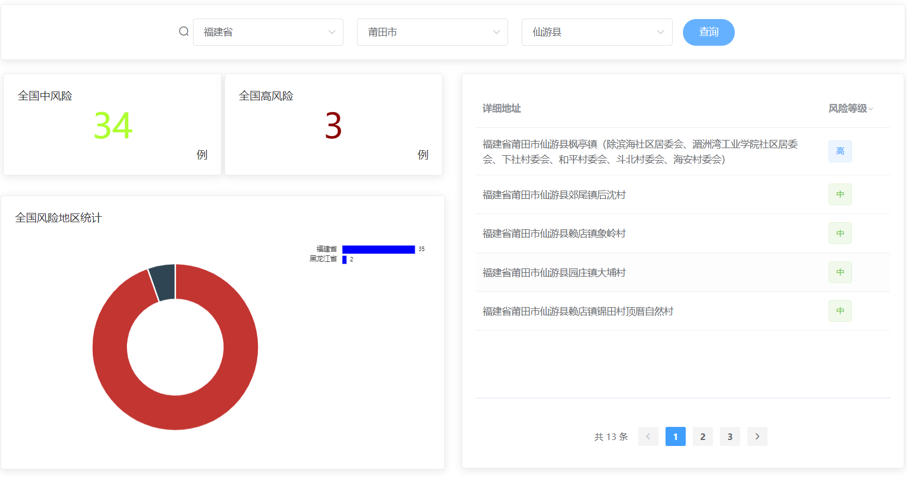
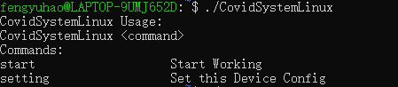
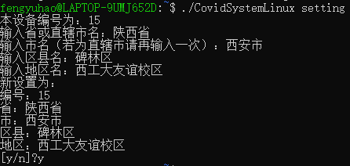
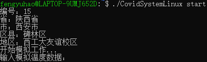
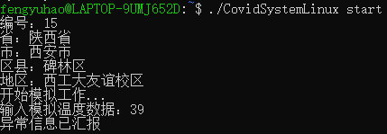
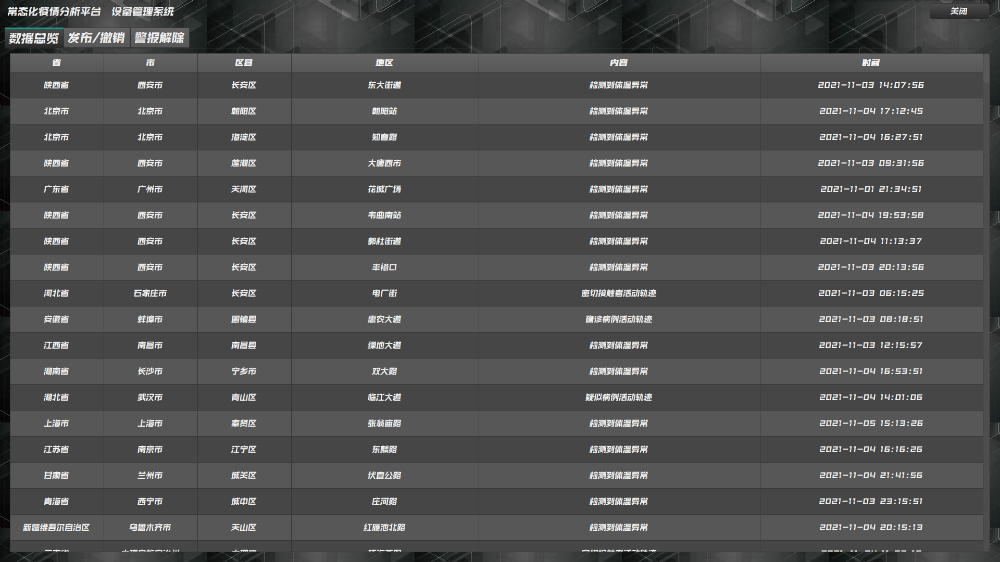
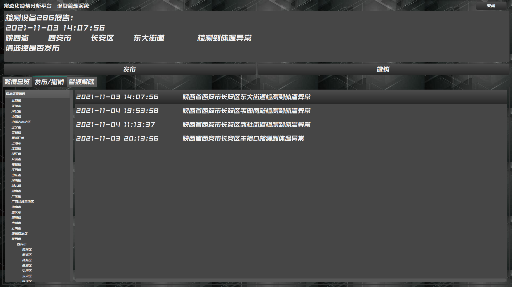
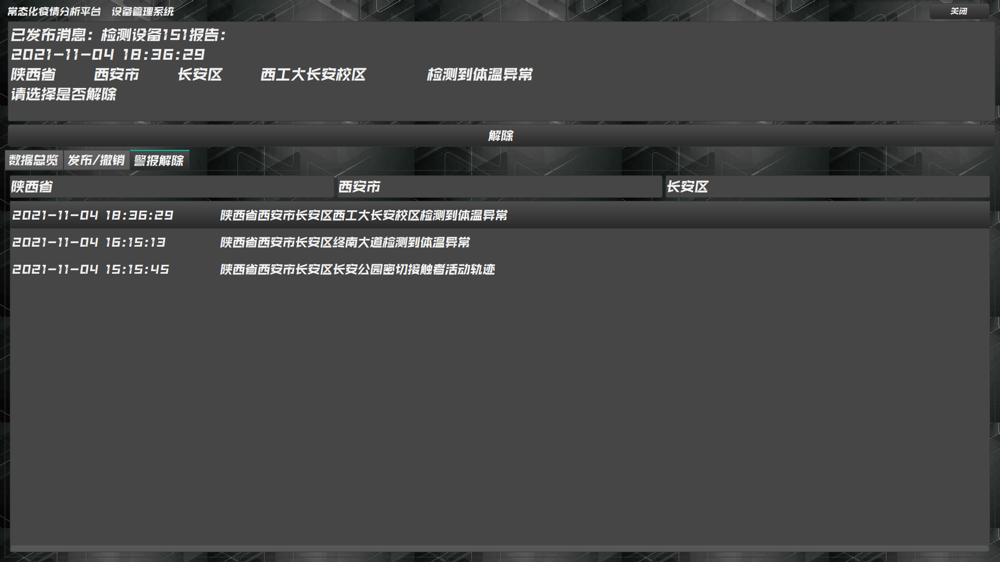

# **常态化疫情分析平台**

https://github.com/fyhhhh/Cov19System

获取最新代码，请选择master分支

获取最新版本程序，请选择release tag中发布的程序及附件

**本系统仅用于西北工业大学计算机学院2021—2022年秋学期应用综合实验设计作业；**

**版权归原作者所有，未经原作者允许不得用于其它途径，否则将视为侵权；**

**转载或者引用部分内容请注明来源及原作者；**

**对于不遵守此声明或者其他违法使用本文内容者，本人依法保留追究权等。**

### Release

2021.11.05:	V1.0

### 文件导航

| **目录**             | **内容**                                                     |
| -------------------- | ------------------------------------------------------------ |
| /CovidSystemBackend  | 基于Go语言实现的Web服务端及数据库交互模块——Goland2021项目    |
| /CovidSystemControl  | 基于C++语言实现的Windows-PC可控管理端模块——Virtual Studio 2019项目，基于QT5扩展 |
| /CovidSystemFrontend | 基于JavaScript实现的Web网页客户端及用户交互模块——WebStorm项目 |
| /CovidSystemLinux    | 基于C语言实现的Linux嵌入式终端模块——Linux-c语言源文件        |
| /crawler             | 基于Python语言实现的数据获取爬虫模块——python文件             |
| /SQLData             | 基于MySQL数据库的数据存储模块——数据库备份文件                |


## 更新日志

##### 2021.11.5

--update--

1. 加入了CovidSystemFrontend程序源码
2. 文档更新基于JavaScript实现的Web网页客户端及用户交互模块

------

##### 2021.11.4 23:00

--update--

1. CovidSystemLinux加入了项目
2. 更新了CovidSystemControl和CovidSystemLinux两部分的文档

-----

##### 2021.11.4 18:00

--update--

1. 优化了异常信息及警报表，添加了日期和设备编号字段
2. 完成发布、撤销、解除功能按钮和POST JSON
3. 优化管理端界面设计

-----

##### 2021.11.1

--update--

1. 美化管理端界面布局，增加了背景图片
2. 取消了菜单栏，增加了右上角关闭按钮

-----

##### 2021.10.30

--update--

1. Qt界面基本设计
2. 总体列表逻辑和树状查询列表逻辑

-----

##### 2021.10.28

--update--

1. 优化了管理端接口
2. 新增了省市县数据集和查询接口
3. 管理端页面总览和树状逻辑完成

-----

##### 2021.10.27

--update--

1. 将reports表拆分为reports表和abnormals表，新增区县字段
2. 重构了服务器面向管理端模块和嵌入式模块的接口
3. 引入了StyleDemo QT5样式系列
4. 对管理端和嵌入式模块进行简单设计

----

##### 2021.10.22 16:30

---update---

1. 整理了其它项目文件
2. 所有项目代码被整合至此仓库，不再只是后端

----

##### 2021.10.22 16:00

---update---

1. 更新了GET Details接口，现在可通过all批量查询省或市级信息
2. 更新了GET details和爬虫部分的文档
3. 通过exe同目录下新建passwd.txt文件存储数据库密码便于调试

---fixed---

1. 修复了地区未确定可能出现的负数现存确诊问题

----

##### 2021.10.20

---update---

1. 优化了后端数据计算，前端不再需要计算确诊数
2. 增加了省级查询，可以查询省级信息

----

## **1 整体设计**

本项目旨在实现一个常态化疫情分析平台，将包含以下几个模块：

1. 基于Python语言实现的数据获取爬虫模块
2. 基于MySQL数据库的数据存储模块
3. 基于Go语言实现的Web服务端及数据库交互模块
4. 基于JavaScript实现的Web网页客户端及用户交互模块
5. 基于C语言实现的Linux嵌入式终端模块
6. 基于C++语言实现的Windows-PC可控管理端模块

## **2 基于Python语言实现的数据获取爬虫模块**

使用Python爬虫从网站获取信息

目标网站为 https://news.qq.com/zt2020/page/feiyan.htm#/?pool=heilongjiang&ADTAG=hesuan

### 2.1 更新全国疫情历史数据

**url：**"https://view.inews.qq.com/g2/getOnsInfo?name=disease_h5"

**数据结构：**
时间、累计确诊数、当日新增确诊、累计疑似确诊数、当日新增确诊数、累积治愈数、当日新增治愈、累计死亡数、当日新增死亡数

### 2.2 更新当前全国各地的疫情数据

**url：**"https://view.inews.qq.com/g2/getOnsInfo?name=disease_other"

**数据结构：**
id、时间、省份、城市、累计确诊数、当日新增确诊、累计治愈数、累计死亡数

### 2.3 更新全国新冠检测点数据（本步骤可选）

**url格式：**

`https://apis.map.qq.com/place_cloud/search`

`/region?region=[省/直辖市]&table_id=0ohEwy0ongOP8nIPH1&orderby=id`

`&page_index=[结果页数]&page_size=[页面记录条数(100/200)]&key=YNVBZ-FRJK3-BPX36-3XHBZ-U7WFQ-KBFMJ`

**数据结构：**
id、省份、城市、地区、详细地址、检测站名称、联系电话、经度、纬度

### 2.4 更新当前全国中高风险地区信息

**url：**"https://eyesight.news.qq.com/sars/riskarea"

**数据结构：**
id、风险级别、风险地区地址

## **3 基于MySQL数据库的数据存储模块**

使用*MySQL*数据库存储获取到的信息

建立 *tables* 如下：

1. *historys* 存储每日新增和累计的确诊、疑似、治愈、死亡数据
2. *details* 存储每日新确诊病例的地区及该地区累计和新增的确诊人数
3. *hospitals* 存储定点核酸检测医院的省市县区及地址、名称、电话和经纬度
4. *risk_areas* 存储目前中高风险地区地址及等级
5. *reports* 存储由嵌入式设备汇报管理端审核的突发警报信息

## 4. 基于Go语言实现的Web服务端及数据库交互模块

以Go语言为基础，基于Gin框架和GORM工具的MySQL数据库操作进程

本模块基于项目需求提供如下接口供其他模块调用：

### 4.1 提供给用户客户端的接口

#### 4.1.1 区县级的疫情现状查询

##### 4.1.1.1 获取全部

GET [IP]:[PORT]/details

```json
RETURN JSON:
[
    {
        "Id": 2,
        "UpdateTime": "2021-09-24T14:07:56+08:00",
        "Province": "福建",
        "City": "厦门",
        "Confirm": 261,
        "ConfirmAdd": 11,
        "Heal": 39,
        "Dead": 0
    },
]
```

|     Key      |    Value     |
| :----------: | :----------: |
|  *Confirm*   | 历史累计确诊 |
| *ConfirmAdd* | 当日新增确诊 |
|    *Heal*    | 历史累计治愈 |
|     Dead     | 历史累计死亡 |

***tips*：现存确诊 = *Confirm - Heal - Dead***

##### 4.1.1.2 指定查询

GET [IP]:[PORT]/details?province=[省/直辖市] (&city=[市/直辖市区]) (&newest=true)

本节所用字段键值含义如下：

|        Key        |    Value     |
| :---------------: | :----------: |
|    *TotalNow*     |  现存确诊数  |
| *TotalConfirmAdd* | 当日新增确诊 |
|    *TotalHeal*    | 历史累计治愈 |
|    *TotalDead*    | 历史累计死亡 |

①查询某省历史数据

```json
GET localhost:8080/details?province=福建
RETURN JSON:
[
    {
        "UpdateTime": "2021-09-24T14:07:56+08:00",
        "Province": "福建",
        "TotalNow": 474,
        "TotalConfirmAdd": 16,
        "TotalHeal": 789,
        "TotalDead": 1
    },
]
```

②查询某省最新一条数据

```Json
GET localhost:8080/details?province=福建&newest=true
RETURN JSON:
[
    {
        "UpdateTime": "2021-10-15T13:56:48+08:00",
        "Province": "福建",
        "TotalNow": 81,
        "TotalConfirmAdd": 0,
        "TotalHeal": 1212,
        "TotalDead": 1
    }
]
```

③查询某市历史数据

```json
GET localhost:8080/details?province=福建&city=厦门
RETURN JSON:
[
    {
        "UpdateTime": "2021-09-24T14:07:56+08:00",
        "Province": "福建",
        "City": "厦门",
        "TotalNow": 222,
        "TotalConfirmAdd": 11,
        "TotalHeal": 39,
        "TotalDead": 0
    },
]
```

④查询某市最新一条数据

```json
GET localhost:8080/details?province=福建&city=厦门&newest=true
RETURN JSON:
[
    {
        "UpdateTime": "2021-10-15T13:56:48+08:00",
        "Province": "福建",
        "City": "厦门",
        "TotalNow": 74,
        "TotalConfirmAdd": 0,
        "TotalHeal": 201,
        "TotalDead": 0
    }
]
```

##### 4.1.1.3 查询所有省级数据

GET [IP]:[PORT]/details?province=all (&newest=true)

```json
GET localhost:8080/details?province=all&newest=true
RETURN JSON:
[
    {
        "UpdateTime": "2021-10-15T13:56:48+08:00",
        "Province": "台湾",
        "TotalNow": 1593,
        "TotalConfirmAdd": 17,
        "TotalHeal": 13742,
        "TotalDead": 841
    },
]
```

##### 4.1.1.4 查询某省/直辖市下所有市/直辖市区级数据

GET [IP]:[PORT]/details?province=[省/直辖市] &city=all (&newest=true)

```json
GET localhost:8080/details?province=福建&city=all&newest=true
RETURN JSON:
[
    {
        "UpdateTime": "2021-10-15T13:56:48+08:00",
        "Province": "福建",
        "City": "厦门",
        "TotalNow": 222,
        "TotalConfirmAdd": 11,
        "TotalHeal": 39,
        "TotalDead": 0
    },
]
```


#### 4.1.2 疫情历史数据查询

GET [IP]:[PORT]/histories

```json
RETURN JSON:
[
    {
        "Ds": "2021-08-16T00:00:00+08:00",
        "Confirm": 122433,
        "ConfirmAdd": 55,
        "Suspect": 1,
        "SuspectAdd": 1,
        "Heal": 112893,
        "HealAdd": 60,
        "Dead": 5669,
        "DeadAdd": 0
    },
]
```

#### 4.1.3 中高风险区查询

GET [IP]:[PORT]/risk_areas

```jso
RETURN JSON:
[
    {
        "Id": 2,
        "RiskLevel": "1",
        "Address": "福建省莆田市仙游县郊尾镇后沈村"
    },
]
```

#### 4.1.4 核酸检测地点查询

GET [IP]:[PORT]/hospitals?province=[省/直辖市]&city=[市/直辖市]&district=[区县]

```json
GET localhost:8080/hospitals?province=陕西省&city=西安市&district=长安区
RETURN JSON:
[
    {
        "Id": 7148,
        "Province": "陕西省",
        "City": "西安市",
        "District": "碑林区",
        "Address": "陕西省西安市雁塔区翠华路345号",
        "Title": "西安市雁塔区疾病预防控制中心",
        "Tel": "0298-5263293",
        "Lat": 34.231994,
        "Lng": 108.96329
    },
]
```

##### 4.1.5 突发疫情信息查询

GET [IP]:[PORT]/reports?province=[省/直辖市]&city=[市/直辖市]&county=[区县]

```json
GET localhost:8080/reports?province=陕西省&city=西安市&county=长安区
RETURN JSON:
[
    {
        "IdReport": 1,
        "Province": "陕西省",
        "City": "西安市",
        "County": "长安区",
        "District": "西工大长安校区",
        "Info": "检测到体温异常",
        "Time": "2021-11-04 14:07:56",
        "Device": 15
    },
]
```


### 4.2 提供给管理客户端的接口

##### 4.2.1 获取未处理的异常信息

从abnormal表获取信息：

GET [IP]:[PORT]/abnormal (?province=[省/直辖市]&city=[市/直辖市]&county=[区县])

```json
GET localhost:8080/abnormal?province=陕西省&city=西安市&county=碑林区
RETURN JSON:
[
    {
        "IdAbnormal": 2,
        "Province": "陕西省",
        "City": "西安市",
        "County": "碑林区",
        "District": "西工大友谊校区",
        "Info": "检测到体温异常",
        "Time": "2021-11-04 14:07:56",
        "Device": 188
    },
]
```

##### 4.2.2 警报信息汇报

将abnormal表中信息删除，同时向reports表中发送信息：

POST [IP]:[PORT]/reports

```json
POST JSON:
{
    "Province": "陕西省",
    "City": "西安市",
    "County": "碑林区",
    "District": "西工大友谊校区",
    "Info": "检测到体温异常",
    "Time": "2021-11-04 14:07:56",
    "Device": 188
}
```

##### 4.2.3 警报信息解除

将reports表中信息删除：

POST  [IP]:[PORT]/reports_delete

```json
POST JSON:
{
    "Province": "陕西省",
    "City": "西安市",
    "County": "碑林区",
    "District": "西工大友谊校区",
    "Info": "检测到体温异常",
    "Time": "2021-11-04 14:07:56",
    "Device": 188
}
```

##### 4.2.4 异常信息撤销

将abnormal表中信息删除：

POST  [IP]:[PORT]/abnormal_delete

```json
POST JSON:
{
    "Province": "陕西省",
    "City": "西安市",
    "County": "碑林区",
    "District": "西工大友谊校区",
    "Info": "检测到体温异常",
    "Time": "2021-11-04 14:07:56",
    "Device": 188
}
```

##### 4.2.5 突发疫情信息查询

同4.1.5节内容

### 4.3 提供给嵌入式终端的接口

##### 4.3.1 异常信息汇报

向abnormal表中发送信息：

POST [IP]:[PORT]/abnormal

```json
POST JSON:
{
    "Province": "陕西省",
    "City": "西安市",
    "County": "长安区",
    "District": "东大街道",
    "Info": "检测到体温异常",
    "Time": "2021-11-03 14:07:56",
    "Device": 286
}
```

### 4.4 省市县信息接口

##### 4.4.1 查询所有省级信息

GET [IP]:[PORT]/area?province=all

```json
GET localhost:8080/area?province=all
[
    "北京市",
    "天津市",
    ...
]
```

##### 4.4.2 查询某省所有市级信息

GET [IP]:[PORT]/area?province=[省名]

```json
GET localhost:8080/area?province=陕西省
RETURN JSON:
[
    "西安市",
    "铜川市",
    ...
]
```

##### 4.4.3 查询某市所有县级信息

GET  [IP]:[PORT]/area?city=[市名]

```json
GET localhost:8080/area?city=西安市
RETURN JSON:
[
    "市辖区",
    "新城区",
    ...
]
```

##### 4.4.4 查询所有省市县三级信息

GET [IP]:[PORT]/area

```json
GET localhost:8080/area
RETURN JSON:
[
    {
        "Province": "北京市",
        "City": "北京市",
        "County": "东城区"
    },
    {
        "Province": "北京市",
        "City": "北京市",
        "County": "西城区"
    },
    ...
]
```


## 5 **基于JavaScript实现的Web网页客户端及用户交互模块**

### 5.1 总述

​	本项目采用Vue-cli搭建整个前端页面。可以对接后端接口，进行疫情可视化分析以及相关信息的查询。

##### 5.1.1 技术选型

* 编程语言：JavaScript
* js框架：vue.js
* 路由：vue-router
* 网络库：axios
* UI框架：Element-UI，echart

##### 5.1.2 页面概述

​	整个前端分为一个主界面以及四个子界面，相应位置及功能如下所示：

| 路由      | 功能                                         |
| :-------- | :------------------------------------------- |
| /         | 主界面的整体展示，负责相关页面的跳转         |
| /map      | 展示全国的疫情数据以及历史趋势               |
| /hospital | 查询核酸检测点的相关信息                     |
| /route    | 通过定位当前位置，获取风险信息，进行风险评估 |
| /riskarea | 展示全国中高风险地区，并提供条件检索         |

### 5.2 功能展示

##### 5.2.1 主界面

​	采用了侧边栏-主要页面的布局方式，可以通过点击侧边栏，实现右侧页面的跳转。整体布局如下：


​	为侧边栏每个按钮赋予路由跳转的功能，即可实现点击后的页面跳转，具体实现方式如下：

```html
<router-link to="/map" tag="el-menu-item" ><i class="el-icon-s-grid"/>疫情地图</router-link>
<router-link to="/riskArea" tag="el-menu-item" ><i class="el-icon-s-flag"/>风险地区</router-link>
<router-link to="/hospital" tag="el-menu-item" ><i class="el-icon-first-aid-kit"/>核酸检测点</router-link>
<router-link to="/route" tag="el-menu-item" ><i class="el-icon-user-solid"/>个人流调</router-link>
```

##### 5.2.2 map页

​	map页的整体布局如下：


其功能有：

* 单击地图省份

  可以获取到其所选中省的疫情信息、疫情组成以及相关历史趋势。

  

* 双击地图省份

  可以获取省级地图，以及各个市级单位的疫情信息、疫情组成。

  

##### 5.2.3 hospital页

​	hospital页的整体布局如下：


​	其功能有：

* 条件查询

  通过上方的复选栏可以实现精确到区县级的查询，同时在点击某省份后，市级待选栏会转变为该省的所有市。

  

  在选定省市县之后，点击查询，即可查询到相应地区的所有核酸检测点。

  

* 详情查看

  ​	在表格中的每项存在一个详情按钮，单击后会出现该医院的详细信息。

  

##### 5.2.4 route页

​	route页的整体布局如下：


​	左侧为当前信息的面板，可以通过获取定位按钮获取当前所在的位置。

​	右侧为风险分析面板，会根据定位信息，进行风险的评估。

​	具体效果如下：


##### 5.2.5 riskarea页

​	riskarea页的整体布局如下：


​	界面展示了全国的中高风险区域的数量以及具体构成，同时也包含全部的详细信息。

​	同时可以使用与hospital页一样的操作进行精确的条件查询，具体效果如下：



 


## 6 **基于C语言实现的Linux嵌入式终端模块**

本模块使用Linux命令行模拟嵌入式设备的终端模块，这将模拟体温监测终端，实际使用中接入体温传感器提供数据替代模拟数据

CovidSystemLinux程序在无参数执行时显示帮助信息：



<br/>

### 6.1 设备位置初始设置

设备编号及位置信息（省、市、区县、地区）在配置文件setting.cfg中

带setting参数执行将进入设置模式：



<br/>

### 6.2 体温传感器模拟

使用简单的命令行输入代替体温传感器的温度数据

带start参数执行将进入模拟模式，循环输入模拟体温数据



<br/>

### 6.3 异常信息POST

当体温大于等于37.5时，将向服务器报告异常信息

通过构造发送HTTP1.1 POST的方式与数据服务器交互

服务器IP及端口保存在IP.cfg配置文件中

除了配置中的信息外，还将自动获取异常出现时间



<br/>


## 7 **基于C++语言实现的Windows-PC可控管理端模块**

本模块作为管理端，通过人工筛选审核终端嵌入式设备发送的异常信息，进行发布、撤销、解除操作

本模块基于C++QT5框架实现，对接基于Go语言实现的Web服务端及数据库交互模块，通过HTTP请求响应与数据服务器进行交互

本模块采用MVC设计模式增加代码复用率，增强维护性和可扩展性，Model类（本例中为Information类及其子类）负责存储数据以及定义如何操作这些数据，View类（本例中为CovidSystemControl类）负责展示而且允许用户编辑来自应用程序的Model对象，Controller类（本例中为CovidInfoController类）负责传递数据

程序主页面由三个分页面（Tab）组成，下面详述各分页面：

### 7.1 异常信息总览



本页面为系统首页，无交互功能，可作为主页屏幕显示系统中所有未操作的异常信息

页面有滚动条，可通过鼠标滚轮上下滑动显示更多

### 7.2 预警信息发布或撤销



本页面的功能为选择某一信息，并进行发布或撤销操作

若发布，信息将进入reports表；若撤销，信息将被删除

页面下半部分为筛选模块，实现省-市-县三级树状列表筛选，而后在右侧列表列出所选县级详细信息

页面上半部分为操作交互模块，从列表中选中的县级详细信息将在上方文本框中显示，随后可以使用发布/撤销按钮交互

### 7.3 预警信息解除



本页面的功能为选择某一信息，进行解除操作

信息来自于reports表，即已发布的异常信息，若解除，信息将被删除

页面下半部分为筛选模块，通过省-市-县三级comboBox下拉菜单筛选，而后在下方列表列出详细信息

页面上半部分为操作交互模块，从列表中选中的县级已发布信息的详细信息将在上方文本框中显示，随后可以使用解除按钮交互


